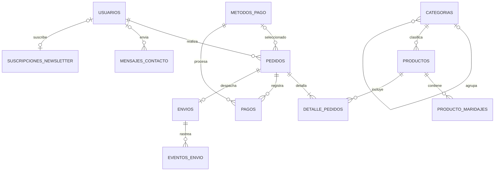

# Base de datos definitiva

La base de datos MySQL es la única fuente de verdad de la aplicación. El catálogo,
usuarios, pedidos, pagos, formularios y envíos no se leen de archivos JSON.

## Modelo ER

- `modelo-er-definitivo.dbml`: fuente editable para dbdiagram.io.
- `modelo-er-definitivo.mmd`: fuente Mermaid editable y renderizable en GitHub.
- `tablas ER ecommerce sierra dorada.png`: diagrama histórico conservado como referencia.

El modelo definitivo amplía el diagrama histórico con consentimiento de usuarios,
catálogo enriquecido y maridajes, contacto, newsletter, costo y trazabilidad de
envíos, eventos de MiPaquete y pagos idempotentes.

## Migraciones

Flyway ejecuta en orden los archivos de `db/migration`:

1. `V1__modelo_relacional_definitivo.sql` crea el esquema completo en instalaciones nuevas.
2. `V2__evolucion_modelo_anterior.sql` completa una base creada con el modelo anterior.
3. `V3__catalogo_inicial.sql` carga el catálogo inicial directamente en MySQL.
4. `V4__confirmacion_correo_usuarios.sql` agrega el estado y token de verificación del correo.
5. `V5__unidades_fisicas_para_envio.sql` distingue unidades, 4-packs y cajas para cotizar bultos reales.

`setup-ecommerce-sd.sql` se mantiene como punto de entrada manual para MySQL Workbench.
En ejecución normal, Spring Boot aplica las migraciones automáticamente.

## Relación principal

